# Breadboarding

Breadboarding transforms a workflow description into a complete map of affordances and their relationships. The output is always a set of tables showing numbered UI and Code affordances with their Wires Out and Returns To relationships. The tables are the truth. Mermaid diagrams are optional visualizations for humans.

---

## Use Cases

Breadboarding serves two functions:

### 1. Mapping an Existing System

You don't understand how an existing system works in its concrete details. You have a workflow you're trying to understand — explaining how something happens or why something doesn't happen.

**Input:**
- Code repo(s) to analyze
- Workflow description (always from the perspective of an operator trying to make an effect happen — through UI or as a caller)

**Output:**
- UI Affordances table
- Code Affordances table
- (Optional) Mermaid visualization

**Note:** If the workflow spans multiple applications (frontend + backend), create ONE breadboard that tells the full story. Label places to show which system they belong to.

### 2. Designing from Shaped Parts

You have a new system sketched as an assembly of parts (mechanisms) per shaping. You need to detail out the concrete mechanism and show how those parts interact as a system.

**Input:**
- Parts list (mechanisms from shaping)
- The R (requirement/outcome) the parts are meant to achieve
- Existing system (optional) — if the new parts must interoperate with existing code

**Output:**
- UI Affordances table
- Code Affordances table
- (Optional) Mermaid visualization

### Mixtures

Often you have both: an existing system that must remain as-is, plus new pieces or changes defined in a shape. In this case, breadboard both together — the existing affordances and the new ones — showing how they connect.

---

## Core Concepts

### Places

A Place is a **bounded context of interaction**. While you're in a Place:
- You have a specific set of affordances available to you
- You **cannot** interact with affordances outside that boundary
- You must take an action to leave

**Place is perceptual, not technical.** It's not about URLs or components — it's about what the user experiences as their current context. A Place is "where you are" in terms of what you can do right now.

#### The Blocking Test

The simplest test for whether something is a different Place: **Can you interact with what's behind?**

| Answer | Meaning |
|--------|---------|
| **No** | You're in a different Place |
| **Yes** | Same Place, with local state changes |

#### Examples

| UI Element | Blocking? | Place? | Why |
|------------|-----------|--------|-----|
| Modal | Yes | Yes | Can't interact with page behind |
| Confirmation popover | Yes | Yes | Must respond before returning (limit case of modal) |
| Edit mode (whole screen transforms) | Yes | Yes | All affordances changed |
| Checkbox reveals extra fields | No | No | Surroundings unchanged |
| Dropdown menu | No | No | Can click away, non-blocking |
| Tooltip | No | No | Informational, non-blocking |

#### Local State vs Place Navigation

When a control changes state, ask: did *everything* change, or just a subset while the surroundings stayed the same?

| Type | What happens | How to model |
|------|--------------|--------------|
| **Local state** | Subset of UI changes, surroundings unchanged | Same Place, conditional N → dependent Us |
| **Place navigation** | Entire screen transforms, or blocking overlay | Different Places |

#### Mode-Based Places

When a mode (like "edit mode") transforms the entire screen — different buttons, different affordances everywhere — model as separate Places:

```
PLACE: CMS Page (Read Mode)
PLACE: CMS Page (Edit Mode)
```

The state flag (e.g., `editMode$`) that switches between them is a **navigation mechanism**, not a data store. Don't include it as an S in either Place.

#### Three Questions for Any Control

For any UI affordance, ask:
1. Where did I come from to see this?
2. Where am I now?
3. Where do I go if I act on it?

If the answer to #3 is "everything changes" or "I can't interact with what's behind until I respond," that's navigation to a different Place.

#### Labeling Conventions

| Pattern | Use |
|---------|-----|
| `PLACE: Page Name` | Standard page/route |
| `PLACE: Page Name (Mode)` | Mode-based variant of a page |
| `PLACE: Modal Name` | Modal dialog |
| `PLACE: Backend` | API/database boundary |

When spanning multiple systems, label with the system: `PLACE: Checkout Page (frontend)`, `PLACE: Payment API (backend)`.

### Place IDs

Places are first-class elements in the data model. Each Place gets an ID:

| # | Place | Description |
|---|-------|-------------|
| P1 | CMS Page (Read Mode) | View-only state |
| P2 | CMS Page (Edit Mode) | Editing state with page-level controls |
| P2.1 | widget-grid (letters) | Subplace: letter editing widget within P2 |
| P3 | Letter Form Modal | Form for adding/editing letters |
| P4 | Backend | API resolvers and database |

Place IDs enable:
- **Explicit navigation wiring** — wire `→ P2` instead of to an affordance inside
- **Containment tracking** — each affordance declares which Place it belongs to
- **Consistent Mermaid subgraphs** — subgraph ID matches Place ID

### Place References

When a nested place has lots of internal affordances and would clutter the parent, you can **detach** it:

1. Put a **reference node** in the parent place using underscore prefix: `_letter-browser`
2. Define the full place separately with all its internals
3. Wire from the reference to the place: `_letter-browser --> letter-browser`

The reference is a **UI affordance** — it represents "this widget/component renders here" in the parent context.

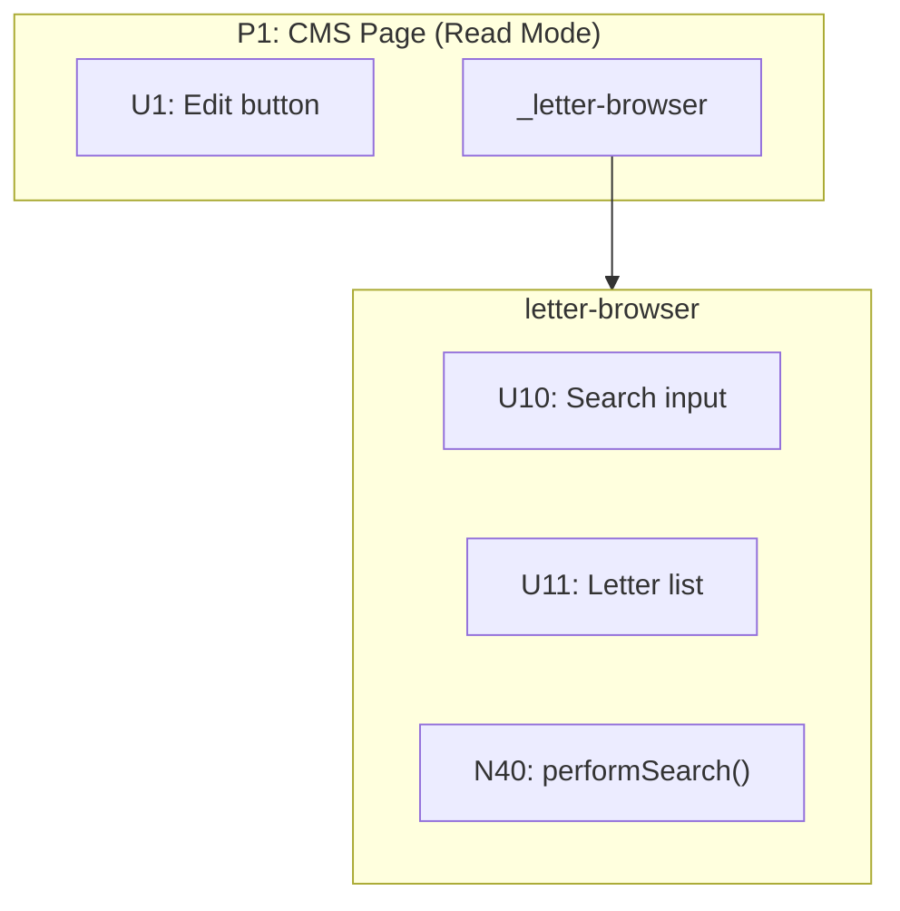

In affordance tables, list the reference as a UI affordance:

| # | Affordance | Control | Wires Out |
|---|------------|---------|-----------|
| U1 | Edit button | click | → N1 |
| _letter-browser | Widget reference | — | → P3 |

Style place references with a dashed border to distinguish them:
```
classDef placeRef fill:#ffb6c1,stroke:#d87093,stroke-width:2px,stroke-dasharray:5 5
class U_LB placeRef
```

### Modes as Places

When a component has distinct modes (read vs edit, viewing vs editing, collapsed vs expanded), model them as **separate places** — they're different perceptual states for the user.

If one mode includes everything from another plus more, show this with a **place reference** inside the extended place:

```
P3: letter-browser (Read)    — base state
P4: letter-browser (Edit)    — contains _letter-browser (Read) + new affordances
```

The reference shows composition: "everything in P3 appears here, plus these additions."

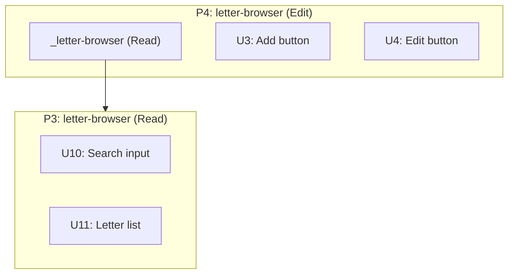

In affordance tables for P4, the reference shows inheritance:

| # | Affordance | Control | Wires Out | Notes |
|---|------------|---------|-----------|-------|
| _letter-browser (Read) | Inherits all of P3 | — | → P3 | |
| U3 | Add button | click | → N3 | NEW |
| U4 | Edit button | click | → N4 | NEW |

### Subplaces

A **subplace** is a defined subset of a Place — a contained area that groups related affordances. Use subplaces when:
- A Place contains multiple distinct widgets or sections
- You're detailing one part of a larger Place
- You want to show what's in scope vs out of scope

**Notation:** Use hierarchical IDs — `P2.1`, `P2.2`, etc. for subplaces of P2.

```
| # | Place | Description |
|---|-------|-------------|
| P2 | Dashboard | Main dashboard page |
| P2.1 | Sales widget | Subplace: sales metrics |
| P2.2 | Activity feed | Subplace: recent activity |
```

In affordance tables, use the subplace ID to show containment:

```
| U3 | P2.1 | sales-widget | "Refresh" button | click | → N4 | — |
| U7 | P2.2 | activity-feed | activity list | render | — | — |
```

**In Mermaid:** Nest the subplace subgraph inside the parent. Use the same background color (no distinct fill) — the subplace is part of the parent, not a separate Place:

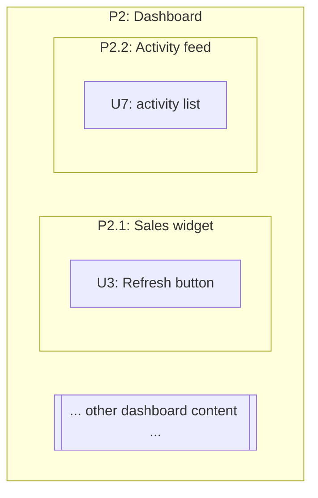

**Placeholder for out-of-scope content:** When detailing one subplace, add a placeholder sibling to show there's more on the page:

```
otherContent[["... other page content ..."]]
```

This tells readers: "we're zooming in on P2.1, but P2 contains more that we're not detailing."

### Containment vs Wiring

These are two different relationships in the data model:

| Relationship | Meaning | Where Captured |
|--------------|---------|----------------|
| **Containment** | Affordance belongs to / lives in a Place | **Place column** (set membership) |
| **Wiring** | Affordance triggers / calls something | **Wires Out column** (control flow) |

**Containment** is set membership: `U1 ∈ P1` means U1 is a member of Place P1. Every affordance belongs to exactly one Place.

**Wiring** is control flow: `U1 → N1` means U1 triggers N1. An affordance can wire to anything — other affordances or Places.

The Place column answers: "Where does this affordance live?"
The Wires Out column answers: "What does this affordance trigger?"

### Navigation Wiring

When an affordance causes navigation (user "goes" somewhere), wire to the **Place itself**, not to an affordance inside:

```
✅ N1 Wires Out: → P2          (navigate to Edit Mode)
❌ N1 Wires Out: → U3          (wiring to affordance inside P2)
```

This makes navigation explicit in the tables. The Place is the destination; specific affordances inside become available once you arrive.

In Mermaid, this becomes:
```
N1 --> P2
```

The subgraph ID matches the Place ID, so the wire connects to the Place boundary.

### Affordances
Things you can act upon:
- **UI affordances (U)**: inputs, buttons, displayed elements, scroll regions
- **Code affordances (N)**: methods, subscriptions, data stores, framework mechanisms

### Wiring
How affordances connect to each other:

**Wires Out** — What an affordance triggers or calls (control flow):
- Call wires: one affordance calls another
- Write wires: code writes to a data store
- Navigation wires: routing to a different place

**Returns To** — Where an affordance's output flows (data flow):
- Return wires: function returns value to its caller
- Read wires: data store is read by another affordance

This separation makes data flow explicit. Wires Out show control flow (what triggers what). Returns To show data flow (where output goes).

---

## The Output: Affordance Tables

The tables are the truth. Every breadboard produces these:

### Places Table

| # | Place | Description |
|---|-------|-------------|
| P1 | Search Page | Main search interface |
| P2 | Detail Page | Individual result view |

### UI Affordances Table

| # | Place | Component | Affordance | Control | Wires Out | Returns To |
|---|-------|-----------|------------|---------|-----------|------------|
| U1 | P1 | search-detail | search input | type | → N1 | — |
| U2 | P1 | search-detail | loading spinner | render | — | — |
| U3 | P1 | search-detail | results list | render | — | — |
| U4 | P1 | search-detail | result row | click | → P2 | — |

### Code Affordances Table

| # | Place | Component | Affordance | Control | Wires Out | Returns To |
|---|-------|-----------|------------|---------|-----------|------------|
| N1 | P1 | search-detail | `activeQuery.next()` | call | → N2 | — |
| N2 | P1 | search-detail | `activeQuery` subscription | observe | → N3 | — |
| N3 | P1 | search-detail | `performSearch()` | call | → N4, → N5, → N6 | — |
| N4 | P1 | search.service | `searchOneCategory()` | call | → N7 | → N3 |
| N5 | P1 | search-detail | `loading` | write | store | → U2 |
| N6 | P1 | search-detail | `results` | write | store | → U3 |
| N7 | P1 | typesense.service | `rawSearch()` | call | — | → N4 |

### Data Stores Table

| # | Place | Store | Description |
|---|-------|-------|-------------|
| S1 | P1 | `results` | Array of search results |
| S2 | P1 | `loading` | Boolean loading state |

### Column Definitions

| Column | Description |
|--------|-------------|
| **#** | Unique ID (P1, P2... for Places; U1, U2... for UI; N1, N2... for Code; S1, S2... for Stores) |
| **Place** | Which Place this affordance belongs to (containment) |
| **Component** | Which component/service owns this |
| **Affordance** | The specific thing you can act upon |
| **Control** | The triggering event: click, type, call, observe, write, render |
| **Wires Out** | What this triggers: `→ N4`, `→ P2` (control flow, including navigation) |
| **Returns To** | Where output flows: `→ N3` or `→ U2, U3` (data flow) |

---

## Procedures

### For Mapping an Existing System

See **Example A** below for a complete worked example.

**Step 1: Identify the flow to analyze**

Pick a specific user journey. Always frame it as an operator trying to do something:
- "Land on /search, type query, scroll for more, click result"
- "Call the payment API with a card token, expect a charge to be created"

**Step 2: List all places involved**

Walk through the journey and identify each distinct place the user visits or system boundary crossed.

**Step 3: Trace through the code to find components**

Starting from the entry point (route, API endpoint), trace through the code to find every component touched by that flow.

**Step 4: For each component, list its affordances**

Read the code. Identify:
- UI: What can the user see and interact with?
- Code: What methods, subscriptions, stores are involved?

**Step 5: Name the actual thing, not an abstraction**

If you write "DATABASE", stop. What's the actual method? (`userRepo.save()`). Every affordance name must be something real you can point to in the code.

**Step 6: Fill in Control column**

For each affordance, what triggers it? (click, type, call, observe, write, render)

**Step 7: Fill in Wires Out**

For each affordance, what does it trigger? Read the code — what does this method call? What does this button's handler invoke?

**Step 8: Fill in Returns To**

For each affordance, where does its output flow?
- Functions that return values → list the callers that receive the return
- Data stores → list the affordances that read from them
- No meaningful output → use `—`

**Step 9: Add data stores as affordances**

When code writes to a property that is later read by another affordance, add that property as a Code affordance with control type `write`.

**Step 10: Add framework mechanisms as affordances**

Include things like `cdr.detectChanges()` that bridge between code and UI rendering. These show how state changes actually reach the UI.

**Step 11: Verify against the code**

Read the code again. Confirm every affordance exists and the wiring matches reality.

---

### For Designing from Shaped Parts

See **Example B** below for a complete worked example including slicing.

**Step 1: List each part from the shape**

Take each mechanism/part identified in shaping and write it down.

**Step 2: Translate parts into affordances**

For each part, identify:
- What UI affordances does this part require?
- What Code affordances implement this part?

**Step 3: Verify every U has a supporting N**

For each UI affordance, check: what Code affordance provides its data or controls its rendering? If none exists, add the missing N.

**Step 4: Classify places as existing or new**

For each UI affordance, determine whether it lives in:
- An existing place being modified
- A new place being created

**Step 5: Wire the affordances**

Fill in Wires Out and Returns To for each affordance. Trace through the intended behavior — what calls what? What returns where?

**Step 6: Connect to existing system (if applicable)**

If there's an existing codebase:
- Identify the existing affordances the new ones must connect to
- Add those existing affordances to your tables
- Wire the new affordances to them

**Step 7: Check for completeness**

- Every U should have an N that feeds it
- Every N should have either Wires Out or Returns To (or both)
- Handlers → should have Wires Out
- Queries → should have Returns To
- Data stores → should have Returns To

**Step 8: Treat user-visible outputs as Us**

Anything the user sees (including emails, notifications) is a UI affordance and needs an N wiring to it.

---

## Key Principles

### Never use memory — always check the data

When tracing a flow backwards, don't follow the path you remember. Scan the Wires Out column for ALL affordances that wire to your target.

When filling in the tables, read each row systematically. Don't rely on what you think you know.

The tables are the source of truth. Your memory is unreliable.

### Every affordance name must exist (when mapping)

When mapping existing code, never invent abstractions. Every name must point to something real in the codebase.

### Mechanisms aren't affordances

An affordance is something you can **act upon** that has meaningful identity in the system. Several things look like affordances but are actually just implementation mechanisms:

| Type | Example | Why it's not an affordance |
|------|---------|---------------------------|
| Visual containers | `modal-frame wrapper` | You can't act on a wrapper — it's just a Place boundary |
| Internal transforms | `letterDataTransform()` | Implementation detail of the caller — not separately actionable |
| Navigation mechanisms | `modalService.open()` | Just the "how" of getting to a Place — wire to the destination directly |

**These aren't always obvious on first draft.** When reviewing your affordance tables, double-check each Code affordance and ask:

> "Is this actually an affordance, or is it just detailing the mechanism for how something happens?"

If it's just the "how" — skip it and wire directly to the destination or outcome.

**Examples:**

```
❌ N8 --> N22 --> P3     (N22 is modalService.open — just mechanism)
✅ N8 --> P3             (handler navigates to modal)

❌ N6 --> N20 --> S2     (N20 is data transform — internal to N6)
✅ N6 --> S2             (callback writes to store)

❌ U7: modal-frame       (wrapper — just the boundary of P3)
✅ U8: Save button       (actionable)
```

The handler navigates to P3. The callback writes to the store. The modal IS P3. The mechanisms are implicit.

### Two flows: Navigation and Data

A breadboard captures two distinct flows:

| Flow | What it tracks | Wiring |
|------|----------------|--------|
| **Navigation** | Movement from Place to Place | Wires Out → Places |
| **Data** | How state populates displays | Returns To → Us |

These are orthogonal. You can have navigation without data changes, and data changes without navigation.

**When reviewing a breadboard, trace both flows:**

1. **Navigation flow:** Can you follow the user's journey from Place to Place?
2. **Data flow:** For every U that displays data, can you trace where that data comes from?

### Every U that displays data needs a source

A UI affordance that displays data must have something feeding it — either a data store (S) or a code affordance (N) that returns data.

```
❌ U6: letter list (no incoming wire — where does the data come from?)
✅ S1 -.-> U6 (store feeds the display)
✅ N4 -.-> U6 (query result feeds the display)
```

If a display U has no data source wiring into it, either:
1. The source is missing from the breadboard
2. The U isn't real

This is easy to miss when focused on navigation. Always ask: "This U shows data — where does that data come from?"

### Every N must connect

If a Code affordance has no Wires Out AND no Returns To, something is wrong:
- Handlers → should have Wires Out (what they call or write)
- Queries → should have Returns To (who receives their return value)
- Data stores → should have Returns To (which affordances read them)

### Side effects need stores

An N that appears to wire nowhere is suspicious. If it has **side effects outside the system boundary** (browser URL, localStorage, external API, analytics), add a **store node** to represent that external state:

```
❌ N41: updateUrl()           (wires to... nothing?)
✅ N41: updateUrl() → S15     (wires to Browser URL store)
```

This makes the data flow explicit. The store can also have return wires showing how external state flows back in:

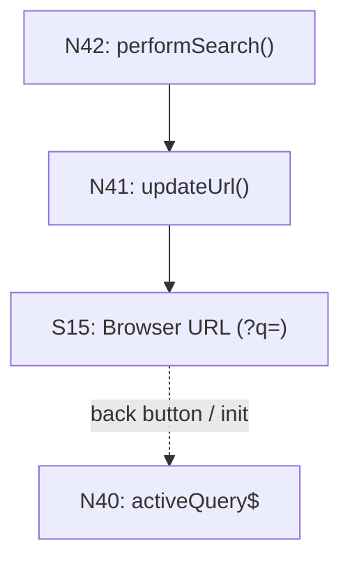

Common external stores to model:
- `Browser URL` — query params, hash fragments
- `localStorage` / `sessionStorage` — persisted client state
- `Clipboard` — copy/paste operations
- `Browser History` — navigation state

### Separate control flow from data flow

Wires Out = control flow (what triggers what)
Returns To = data flow (where output goes)

This separation makes the system's behavior explicit.

### Show navigation inline, not as loops

Routing is a generic mechanism every page uses. Instead of drawing all navigation through a central Router affordance, show `Router navigate()` inline where it happens and wire directly to the destination place.

### Place stores where they enable behavior, not where they're written

A data store belongs in the Place where its data is *consumed* to enable some effect — not where it's produced. Writes from other Places are "reaching into" that Place's state.

To determine where a store belongs:
1. **Trace read/write relationships** — Who writes? Who reads?
2. **The readers determine placement** — that's where behavior is enabled
3. **If only one Place reads**, the store goes inside that Place

Example: A `changedPosts` array is written by a Modal (when user confirms changes) but read by a PAGE_SAVE handler (when user clicks Save). The store belongs with the PAGE_SAVE handler — that's where it enables the persistence operation.

### Only extract to shared areas when truly shared

Before putting a store in a separate DATA STORES section, verify it's actually read by multiple Places. If it only enables behavior in one Place, it belongs inside that Place.

### Nest stores in the subcomponent that reads them

Within a Place, put stores in the subcomponent where they enable behavior. If a store is read by a specific handler, put it in that handler's component — not floating at the Place level.

### Backend is a Place

The database and resolvers aren't floating infrastructure — they're a Place with their own affordances. Database tables (S) belong inside the Backend Place alongside the resolvers (N) that read and write them.

---

## Catalog of Parts and Relationships

This section provides a complete reference of everything that can appear in a breadboard.

### Elements

| Element | ID Pattern | What It Is | What Qualifies |
|---------|------------|------------|----------------|
| **Place** | P1, P2, P3... | A bounded context of interaction | Blocking test: can't interact with what's behind |
| **Subplace** | P2.1, P2.2... | A defined subset within a Place | Groups related affordances within a larger Place |
| **Place Reference** | _PlaceName | UI affordance pointing to a detached place | Complex nested place defined separately |
| **UI Affordance** | U1, U2, U3... | Something the user can see or interact with | Inputs, buttons, displays, scroll regions |
| **Code Affordance** | N1, N2, N3... | Something in code you can act upon | Methods, subscriptions, handlers, framework mechanisms |
| **Data Store** | S1, S2, S3... | State that persists and is read/written | Properties, arrays, observables that hold data |
| **Chunk** | — | A collapsed subsystem | One wire in, one wire out, many internals |
| **Placeholder** | — | Out-of-scope content marker | Shows context without detailing |

### Relationships

| Relationship | Syntax | Meaning | Example |
|--------------|--------|---------|---------|
| **Containment** | Place column | Affordance belongs to Place | `U3` in Place `P2.1` |
| **Wires Out** | `→ X` | Control flow: triggers/calls | `→ N4`, `→ P2` |
| **Returns To** | `→ X` (in Returns To column) | Data flow: output goes to | `→ U6`, `→ N3` |
| **Abbreviated flow** | `\|label\|` | Intermediate steps omitted | `S4 -.-> \|view query\| U6` |
| **Parent-child** | Hierarchical ID | Subplace belongs to Place | P2.1 is child of P2 |

### Containment vs Wiring

| Relationship | Meaning | Where Captured |
|--------------|---------|----------------|
| **Containment** | Affordance belongs to / lives in a Place | Place column (set membership) |
| **Wiring** | Affordance triggers / calls something | Wires Out column (control flow) |

Containment is set membership: `U1 ∈ P1` means U1 is a member of Place P1.
Wiring is control flow: `U1 → N1` means U1 triggers N1.

### What Qualifies as Each Element

**Place (P):**
- Passes the blocking test — can't interact with what's behind
- Examples: modal, edit mode (whole screen transforms), route/page
- Not: dropdown, tooltip, checkbox revealing fields

**Place Reference (_PlaceName):**
- A UI affordance that represents a detached place
- Use when a nested place has many affordances and would clutter the parent
- Examples: `_letter-browser`, `_user-profile-widget`
- Wires to the full place definition: `_letter-browser --> P3`

**UI Affordance (U):**
- User can see it or interact with it
- Examples: button, input, list, spinner, displayed text
- Not: wrapper elements, layout containers

**Code Affordance (N):**
- Has meaningful identity — you can point to it in code
- Examples: `handleSubmit()`, `query$ subscription`, `detectChanges()`
- Not: internal transforms, navigation mechanisms (see below)

**Data Store (S):**
- State that is written and read
- Examples: `results` array, `loading` boolean, `changedPosts` list
- External stores: `Browser URL`, `localStorage`, `Clipboard` — represent state outside the app boundary
- Not: config that's set once and never changes (consider as config affordance)

### Verification Checks

| Check | Question | If No... |
|-------|----------|----------|
| **Every U that displays data** | Does it have an incoming wire (via Wires Out or Returns To)? | Add the data source |
| **Every N** | Does it have Wires Out or Returns To (or both)? | Investigate — may be dead code or missing wiring |
| **Every S** | Does something read from it (Returns To)? | Investigate — may be unused |
| **Navigation mechanisms** | Is this N just the "how" of getting somewhere? | Wire directly to Place instead |
| **N with side effects** | Does this N affect external state (URL, storage, clipboard)? | Add a store for the external state |

---

## Chunking

Chunking collapses a subsystem into a single node in the main diagram, with details shown separately. Use chunking to manage complexity when a section of the breadboard has:

- **One wire in** (single entry point)
- **One wire out** (single output)
- **Lots of internals** between them

### When to Chunk

Look for sections where tracing the wiring reveals a "pinch point" — many affordances that funnel through a single input and single output. These are natural boundaries for chunking.

Example: A `dynamic-form` component receives a form definition, renders many fields (U7a-U7k), validates on change (N26), and emits a single `valid$` signal. In the main diagram, this becomes:

```
N24 -->|formDefinition| dynamicForm
dynamicForm -.->|valid$| U8
```

### How to Chunk

1. **In the main diagram**, replace the subsystem with a single stadium-shaped node:

```
dynamicForm[["CHUNK: dynamic-form"]]
```

2. **Wire to/from the chunk** using the boundary signals:

```
N24 -->|formDefinition| dynamicForm
dynamicForm -.->|valid$| U8
```

3. **Create a separate chunk diagram** showing the internals with boundary markers:

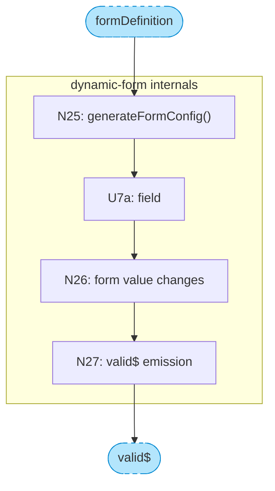

4. **Style chunks distinctly** in the main diagram:

```
classDef chunk fill:#b3e5fc,stroke:#0288d1,color:#000,stroke-width:2px
class dynamicForm chunk
```

### Chunk Color Convention

| Type | Color | Hex |
|------|-------|-----|
| Chunk node (main diagram) | Light blue | `#b3e5fc` |
| Boundary markers (chunk diagram) | Light blue, dashed | `#b3e5fc` with `stroke-dasharray:5 5` |

### Benefits

- **Main diagram stays readable** — complex subsystems become single nodes
- **Detail preserved** — chunk diagrams show the internals when needed
- **Natural boundaries** — chunks often map to reusable components

---

## Visualization (Mermaid)

The tables are the truth. Mermaid diagrams are optional visualizations for humans.

### Basic Structure

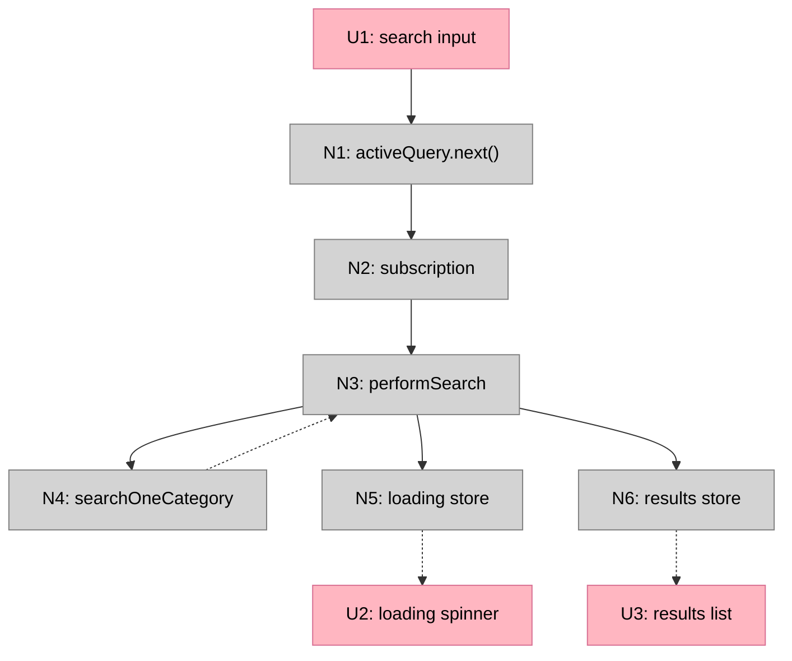

### Line Conventions

| Line Style | Mermaid Syntax | Use |
|------------|----------------|-----|
| Solid (`-->`) | `A --> B` | Wires Out: calls, triggers, writes |
| Dashed (`-.->`) | `A -.-> B` | Returns To: return values, data store reads |
| Labeled `...` | `A -.->|...| B` | Abbreviated flow: intermediate steps omitted |

#### Abbreviating Out-of-Scope Flows

When a data flow has intermediate steps that aren't relevant to the breadboard's scope, abbreviate by wiring directly from source to destination with a `...` label:

```
S4 -.->|...| U6
```

This says "data flows from S4 to U6, with intermediate steps omitted." Use this when:
- The flow exists but its internals are out of scope
- You need to show where data originates without detailing the query chain
- The breadboard focuses on one workflow (e.g., editing) but needs to acknowledge another (e.g., viewing)

### ID Prefixes

| Prefix | Type | Example |
|--------|------|---------|
| **P** | Places | P1, P2, P3 |
| **U** | UI affordances | U1, U2, U3 |
| **N** | Code affordances | N1, N2, N3 |
| **S** | Data stores | S1, S2, S3 |

### Color Conventions

| Type | Color | Hex |
|------|-------|-----|
| Places (subgraphs) | White/transparent | — |
| UI affordances | Pink | `#ffb6c1` |
| Code affordances | Grey | `#d3d3d3` |
| Data stores | Lavender | `#e6e6fa` |
| Chunks | Light blue | `#b3e5fc` |
| Place references | Pink, dashed border | `#ffb6c1` |

```
classDef ui fill:#ffb6c1,stroke:#d87093,color:#000
classDef nonui fill:#d3d3d3,stroke:#808080,color:#000
classDef store fill:#e6e6fa,stroke:#9370db,color:#000
classDef chunk fill:#b3e5fc,stroke:#0288d1,color:#000,stroke-width:2px
classDef placeRef fill:#ffb6c1,stroke:#d87093,stroke-width:2px,stroke-dasharray:5 5
```

### Subgraph Labels and Place IDs

Use the Place ID as the subgraph ID so navigation wiring connects properly:

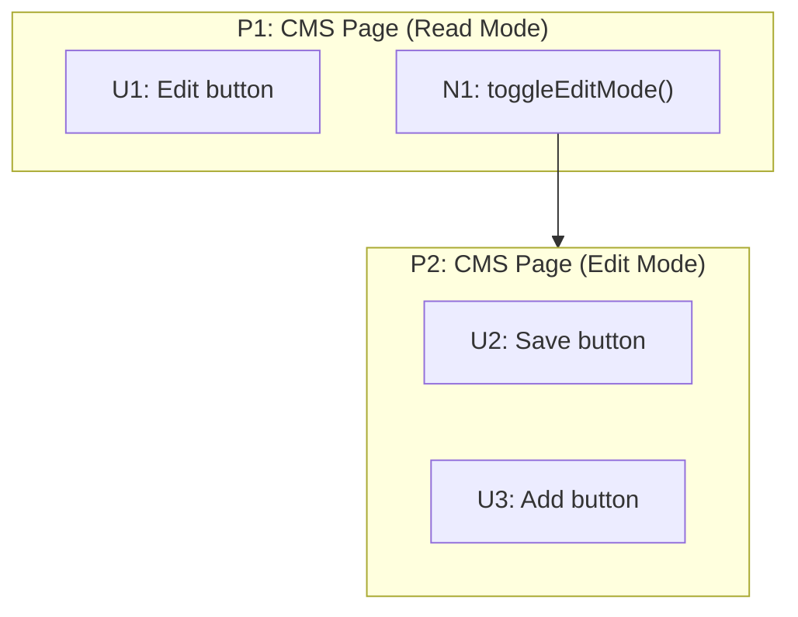

| Type | ID Pattern | Label Pattern | Purpose |
|------|------------|---------------|---------|
| Place | `P1`, `P2`... | `P1: Page Name` | A bounded context the user visits |
| Trigger | — | `TRIGGER: Name` | An event that kicks off a flow (not navigable) |
| Component | — | `COMPONENT: Name` | Reusable UI+logic that appears in multiple places |
| System | — | `SYSTEM: Name` | When spanning multiple applications |

**Key point:** The subgraph ID (`P1`, `P2`) must match the Place ID from the Places table. This allows navigation wires like `N1 --> P2` to connect to the Place boundary.

### When spanning multiple systems

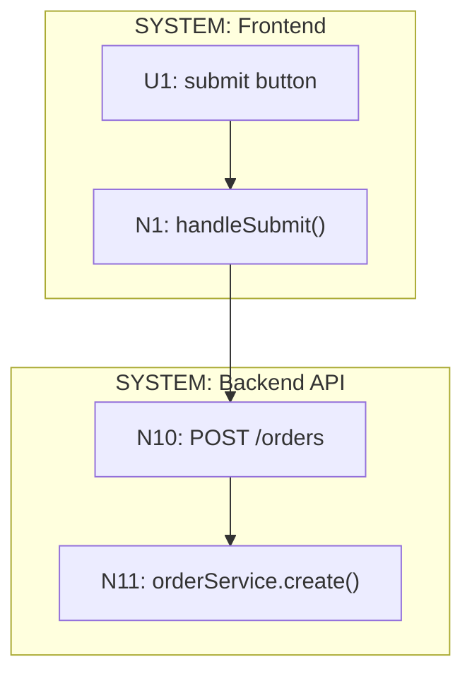

### Workflow Step Annotations (Optional)

When breadboarding a specific workflow, you can optionally add numbered step markers to help readers follow the sequence visually. This is useful when:
- The diagram is complex and the workflow path isn't obvious
- You want to guide someone through a specific user journey
- The breadboard will be used as a walkthrough or teaching tool

**Format:**

Add a Workflow Guide table before the diagram:

```markdown
| Step | Action | Where to look |
|------|--------|---------------|
| **1** | Click "Edit" button | U1 → N1 → S1 |
| **2** | Edit mode activates | S1 → N2 → U3 |
| **3** | Click "Add" | U3 → N3 → N8 |
```

Add step marker nodes in the Mermaid diagram using stadium-shaped nodes:

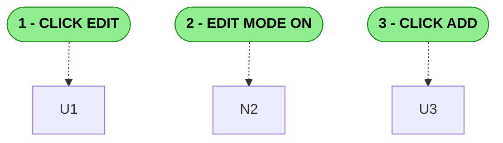

**Formatting notes:**
- Use `"1 - ACTION"` format (number, space, hyphen, space, action)
- Avoid `"1. ACTION"` — the period triggers Mermaid's markdown list parser
- Avoid `"1) ACTION"` — parentheses can also cause parsing issues
- Connect step markers to affordances with dashed lines (`-.->`)
- Style steps green to distinguish from UI (pink) and Code (grey) affordances

---

## Slicing a Breadboard

Slicing takes a breadboard and groups its affordances into **vertical implementation slices**. See **Example B** below for a complete slicing example.

**Input:**
- Breadboard (affordance tables with wiring)
- Shape (R + mechanisms) — guides what demos matter

**Output:**
- Breadboard with affordances assigned to slices V1–V9 (max 9 slices)

### What is a Vertical Slice?

A vertical slice is a group of UI and Code affordances that does something demo-able. It cuts through all layers (UI, logic, data) to deliver a working increment.

The opposite is a horizontal slice — doing work on one layer (e.g., "set up all the data models") that isn't clickable from the interface.

### The Key Constraint

**Every slice must have visible UI that can be demoed.** A slice without UI is a horizontal layer, not a vertical slice.

- ✅ "Self-serve Signing Path" (demo: checkout → sign → see signature)
- ❌ "Database Schema" (no demo possible)

**Demo-able means:**
- Has an entry point (UI interaction or trigger)
- Has an observable output (UI renders, effect occurs)
- Shows meaningful progress toward the R

The shape guides what counts as "meaningful progress" — you're not just grouping affordances arbitrarily, you're grouping them to demonstrate mechanisms working.

### Slice Size

- **Too small:** Only 1-2 UI affordances, no meaningful demo → merge with related slice
- **Too big:** 15+ affordances or multiple unrelated journeys → split
- **Right size:** A coherent journey with a clear "watch me do this" demo

Aim for ≤9 slices. If you need more, the shape may be too large for one cycle.

### Wires to Future Slices

A slice may contain affordances with Wires Out pointing to affordances in later slices. These wires exist in the breadboard but aren't implemented yet — they're stubs or no-ops until that later slice is built.

This is normal. The breadboard shows the complete system; slicing shows the order of implementation.

### Procedure

**Step 1: Identify the minimal demo-able increment**

Look at your breadboard and shape. Ask: "What's the smallest subset that demonstrates the core mechanism working?"

Usually this is:
- The core data fetch
- Basic rendering
- No search, no pagination, no state persistence yet

This becomes V1.

**Step 2: Layer additional capabilities as slices**

Look at the mechanisms in your shape. Each slice should demonstrate a mechanism working:
- V2: Search input (demonstrates the search mechanism)
- V3: Pagination/infinite scroll (demonstrates the pagination mechanism)
- V4: URL state persistence (demonstrates the state preservation mechanism)
- etc.

**Max 9 slices.** If you have more, combine related mechanisms. Features that don't make sense alone should be in the same slice.

**Step 3: Assign affordances to slices**

Go through every affordance and assign it to the slice where it's first needed to demo that slice's mechanism:

| Slice | Mechanism | Affordances |
|-------|-----------|-------------|
| V1 | Core display | U2, U3, N3, N4, N5, N6, N7 |
| V2 | Search | U1, N1, N2 |
| V3 | Pagination | U10, N11, N12, N13 |

Some affordances may have Wires Out to later slices — that's fine. They're implemented in their assigned slice; the wires just don't do anything yet.

**Step 4: Create per-slice affordance tables**

For each slice, extract just the affordances being added:

**V2: Search Works**

| # | Component | Affordance | Control | Wires Out | Returns To |
|---|-----------|------------|---------|-----------|------------|
| U1 | search-detail | search input | type | → N1 | — |
| N1 | search-detail | `activeQuery.next()` | call | → N2 | — |
| N2 | search-detail | `activeQuery` subscription | observe | → N3 | — |

**Step 5: Write a demo statement for each slice**

Each slice needs a concrete demo that shows its mechanism working toward the R:
- V1: "Widget shows real data from the API"
- V2: "Type 'dharma', results filter live"
- V3: "Scroll down, more items load"

The demo should be something you can show a stakeholder that demonstrates progress.

### Visualizing Slices in Mermaid

Show the complete breadboard in every slice diagram, but use styling to distinguish scope:

| Category | Style | Description |
|----------|-------|-------------|
| **This slice** | Bright color | Affordances being added |
| **Already built** | Solid grey | Previous slices |
| **Future** | Transparent, dashed border | Not yet built |

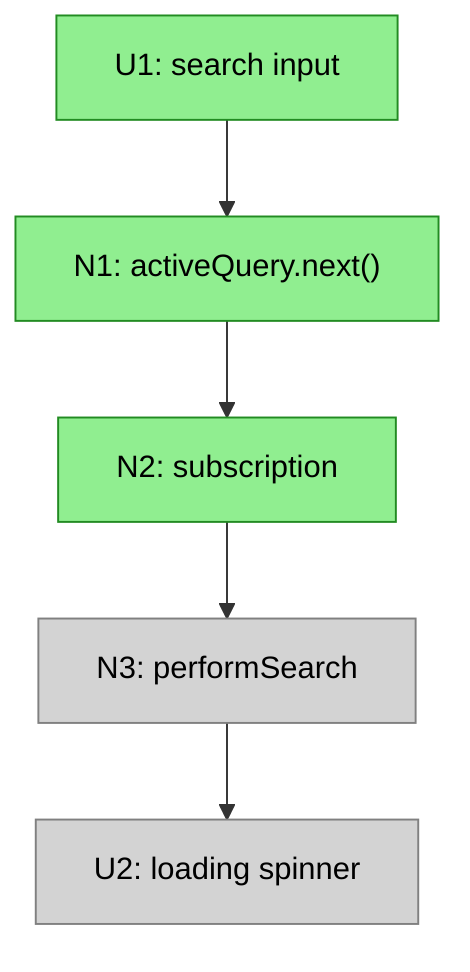

This lets stakeholders see:
- What's being built now (highlighted)
- What already exists (grey)
- What's coming later (faded)

### Slice Summary Format

| # | Slice | Mechanism | Demo |
|---|-------|-----------|------|
| V1 | Widget with real data | F1, F4, F6 | "Widget shows letters from API" |
| V2 | Search works | F3 | "Type to filter results" |
| V3 | Infinite scroll | F5 | "Scroll down, more load" |
| V4 | URL state | F2 | "Refresh preserves search" |

The Mechanism column references parts from the shape, showing which mechanisms each slice demonstrates.

---
---

# Examples

## Example A: Mapping an Existing System

This example shows breadboarding an existing system to understand how data flows through multiple entry points.

### Input

Workflow to understand: "How is `admin_organisation_countries` modified and read downstream? There are multiple entry points: manual edit, checkbox toggle, and batch job."

### Output

**UI Affordances**

| # | Component | Affordance | Control | Wires Out | Returns To |
|---|-----------|------------|---------|-----------|------------|
| U1 | SSO Admin | `role_profiles` checkboxes | render | — | — |
| U2 | SSO Admin | "Country Admin" checkbox | click | toggles selection | — |
| U3 | SSO Admin | `admin_countries` filter_horizontal | render | — | — |
| U4 | SSO Admin | Available countries list | render | — | — |
| U5 | SSO Admin | Selected countries list | render | — | — |
| U6 | SSO Admin | Add → / Remove ← | click | modifies selection | — |
| U7 | SSO Admin | Save button | click | → N3 | — |
| U20 | DWConnect | "Country admins" section | render | — | — |
| U21 | (unknown) | System email "From" field | render | — | — |

**Code Affordances**

| # | Component | Affordance | Control | Wires Out | Returns To |
|---|-----------|------------|---------|-----------|------------|
| N1 | sso/accounts/admin | `get_fieldsets()` | call | → U3 (conditional) | — |
| N2 | sso/accounts/models | `get_administrable_user_countries()` | call | — | → U4 |
| N3 | sso/accounts/admin | `save_form()` | call | → N4, → N5 | — |
| N4 | Django Admin | Form M2M save | call | → S2 | — |
| N5 | sso/forms/mixins | `_update_user_m2m()` | call | → S1, → N6 | — |
| N6 | sso/signals | `user_m2m_field_updated` signal | signal | → N10 | — |
| N7 | CLI/Scheduler | `manage.py dwbn_cleanup` | invoke | → N15 | — |
| N10 | sso-dwbn-theme | `dwbn_user_m2m_field_updated()` | receive | → N11 | — |
| N11 | sso-dwbn-theme | `dwbn_user_m2m_field_updated_task()` | call | → N12 | — |
| N12 | sso-dwbn-theme | Country Admin added AND zero admin countries? | conditional | → N20 | — |
| N15 | sso-dwbn-theme | `admin_changes()` | call | → N16 | — |
| N16 | sso-dwbn-theme | For each Country Admin: home center country missing? | loop | → N20 | — |
| N20 | sso-dwbn-theme | Get home center's country | call | → N21 | — |
| N21 | sso-dwbn-theme | `admin_organisation_countries.add()` | call | → S2 | — |
| N22 | sso-dwbn-theme | `update_last_modified()` | call | — | — |
| N30 | dwconnect2-backend | `findCenterAdmins()` | call | — | → U20 |
| N31 | sso/api | `get_object_data()` | call | — | → external |

**Data Stores**

| # | Store | Description |
|---|-------|-------------|
| S1 | `role_profiles` | M2M: which role profiles a user has |
| S2 | `admin_organisation_countries` | M2M: which countries a user administers |
| S3 | `organisations` | User's home center(s) |

**Mermaid Diagram**

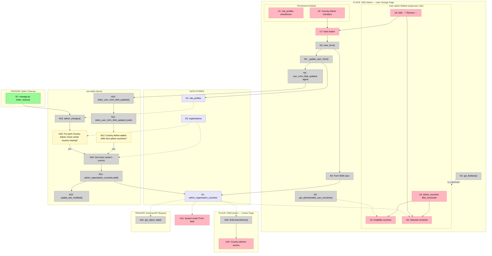

---

## Example B: Designing from Shaped Parts

---

### Part 1: Shaping Context (Input to Breadboarding)

This section shows what comes FROM shaping — the requirements, existing patterns identified, and sketched parts. This is the INPUT that breadboarding receives.

> **Note:** This example uses shaping terminology. In shaping, you define requirements (Rs), identify existing patterns to reuse, and sketch a solution as parts/mechanisms. Breadboarding takes this shaped solution and details out the concrete affordances and wiring.

**The R (Requirements)**

| ID | Requirement |
|----|-------------|
| R0 | Make content searchable from the index page |
| R2 | Navigate back to pagination state when returning from detail |
| R3 | Navigate back to search state when returning from detail |
| R4 | Search/pagination state survives page refresh |
| R5 | Browser back button restores previous search/pagination state |
| R9 | Search should debounce input (not fire on every keystroke) |
| R10 | Search should require minimum 3 characters |
| R11 | Loading and empty states should provide user feedback |

**Existing System with Reusable Patterns (S-CUR)**

The app already has a global search page that implements most of these Rs. During shaping, it was documented at the parts/mechanism level:

| Part | Mechanism |
|------|-----------|
| **S-CUR1** | **URL state & initialization** |
| S-CUR1.1 | Router queryParams observable provides `{q, category}` |
| S-CUR1.2 | `initializeState(params)` sets query and category from URL |
| S-CUR1.3 | On page load, triggers initial search from URL state |
| **S-CUR2** | **Search input** |
| S-CUR2.1 | Search input binds to `activeQuery` BehaviorSubject |
| S-CUR2.2 | `activeQuery` subscription with 90ms debounce |
| S-CUR2.3 | Min 3 chars triggers `performNewSearch()` |
| **S-CUR3** | **Data fetching** |
| S-CUR3.1 | `performNewSearch()` sets loading state, calls search service |
| S-CUR3.2 | Search service builds Typesense filter, calls `rawSearch()` |
| S-CUR3.3 | `rawSearch()` queries Typesense, returns `{found, hits}` |
| S-CUR3.4 | Results written to `detailResult` data store |
| **S-CUR4** | **Pagination** |
| S-CUR4.1 | Scroll-to-bottom triggers `appendNextPage()` via intercomService |
| S-CUR4.2 | `appendNextPage()` increments page, calls search |
| S-CUR4.3 | New hits concatenated to existing hits |
| S-CUR4.4 | `sendMessage()` re-arms scroll detection |
| **S-CUR5** | **Rendering** |
| S-CUR5.1 | `cdr.detectChanges()` triggers template re-evaluation |
| S-CUR5.2 | Loading spinner, "no results", result count based on store |
| S-CUR5.3 | `*ngFor` renders tiles for each hit |
| S-CUR5.4 | Tile click navigates to detail page |

**Sketched Solution: Parts that Adapt S-CUR**

The new solution's parts explicitly reference which S-CUR patterns they adapt:

| Part | Mechanism | Adapts |
|------|-----------|--------|
| F1 | Create widget (component, def, register) | — |
| F2 | URL state & initialization (read `?q=`, restore on load) | S-CUR1 |
| F3 | Search input (debounce, min 3 chars, triggers search) | S-CUR2 |
| F4 | Data fetching (`rawSearch()` with filter) | S-CUR3 |
| F5 | Pagination (scroll-to-bottom, append pages, re-arm) | S-CUR4 |
| F6 | Rendering (loading, empty, results list, rows) | S-CUR5 |

---

### Part 2: Breadboarding (Transform Parts → Affordances)

This is where breadboarding happens. The shaped parts become concrete affordances with explicit wiring. The output is the affordance tables and diagram.

**UI Affordances**

| # | Component | Affordance | Control | Wires Out | Returns To |
|---|-----------|------------|---------|-----------|------------|
| U1 | letter-browser | search input | type | → N1 | — |
| U2 | letter-browser | loading spinner | render | — | — |
| U3 | letter-browser | no results msg | render | — | — |
| U4 | letter-browser | result count | render | — | — |
| U5 | letter-browser | results list | render | → U6, U7, U8, U9 | — |
| U6 | letter-row | row click | click | → LD | — |
| U7 | letter-row | date | render | — | — |
| U8 | letter-row | subject | render | — | — |
| U9 | letter-row | teaser | render | — | — |
| U10 | letter-browser | scroll | scroll | → N11 | — |
| U11 | browser | back button | click | → N9 | — |
| U12 | letter-browser | "See all X results" | click | → LP | — |
| LD | — | Letter Detail | place | — | — |
| LP | — | Full Page | place | — | — |

**Code Affordances**

| # | Component | Affordance | Control | Wires Out | Returns To |
|---|-----------|------------|---------|-----------|------------|
| N1 | letter-browser | `activeQuery.next()` | call | → N2 | → U12 |
| N2 | letter-browser | `activeQuery` subscription | observe | → N3 | — |
| N3 | letter-browser | `performSearch()` | call | → N4, → N6, → N7, → N8 | — |
| N4 | typesense.service | `rawSearch()` | call | — | → N3, → N12 |
| N5 | letter-browser | `parentId` (config) | config | — | → N4 |
| N6 | letter-browser | `loading` store | write | — | → N8 |
| N7 | letter-browser | `detailResult` store | write | — | → N8, → N16 |
| N8 | letter-browser | `detectChanges()` | call | → U2, → U3, → U4, → U5 | — |
| N9 | browser | URL `?q=` | read | → N10 | — |
| N10 | letter-browser | `initializeState()` | call | → N1, → N3 | — |
| N11 | intercom.service | scroll subject | observe | → N12 | — |
| N12 | letter-browser | `appendNextPage()` | call | → N4, → N7, → N8, → N13, → N14 | — |
| N13 | intercom.service | `sendMessage()` | call | → N11 | — |
| N14 | router | `navigate()` | call | — | → N9 |
| N15 | letter-browser | if `!compact` subscribe | conditional | → N11 | — |
| N16 | letter-browser | if truncated show link | conditional | → U12 | — |
| N17 | letter-browser | `compact` (config) | config | — | → N4, → N15, → N16 |
| N18 | letter-browser | `fullPageRoute` (config) | config | — | → U12 |

**Mermaid Diagram**

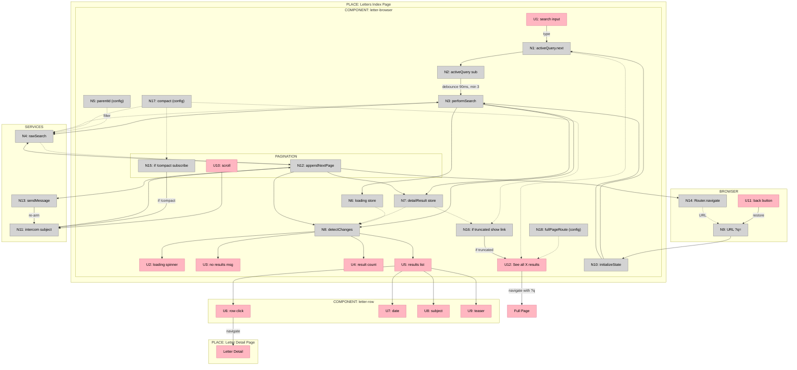

**Slicing the Breadboard**

With the full breadboard complete, slice it into vertical increments. Each slice demonstrates a mechanism working:

**Slice Summary**

| # | Slice | Mechanism | Affordances | Demo |
|---|-------|-----------|-------------|------|
| V1 | Widget with real data | F1, F4, F6 | U2-U9, N3-N8, LD | "Widget shows real data" |
| V2 | Search works | F3 | U1, N1, N2 | "Type 'dharma', results filter" |
| V3 | Infinite scroll | F5 | U10, N11-N13 | "Scroll down, more load" |
| V4 | URL state | F2 | U11, N9, N10, N14 | "Refresh preserves search" |
| V5 | Compact mode | — | U12, N15-N18, LP | "Shows 'See all' link" |

**Slice Diagram**

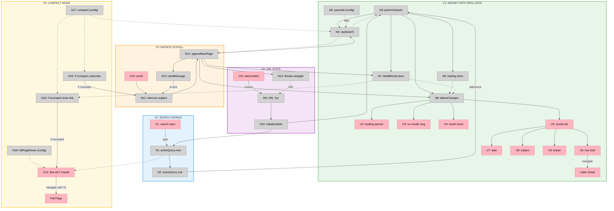
